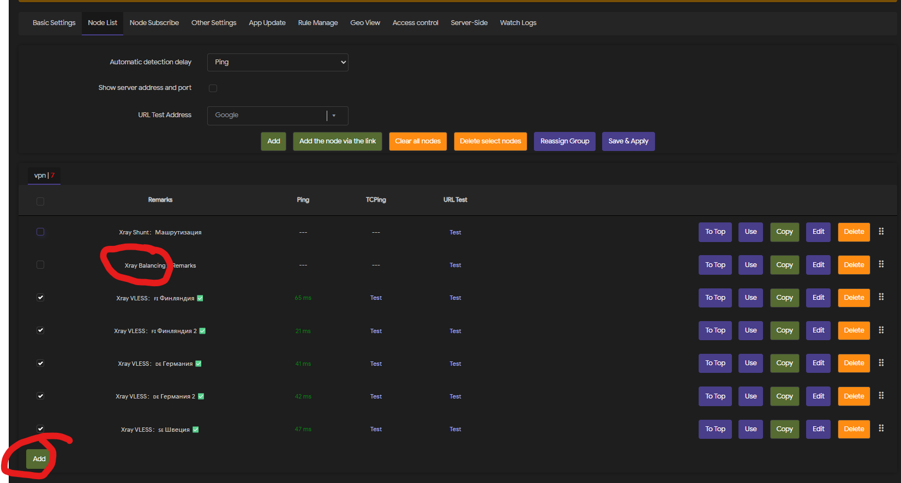
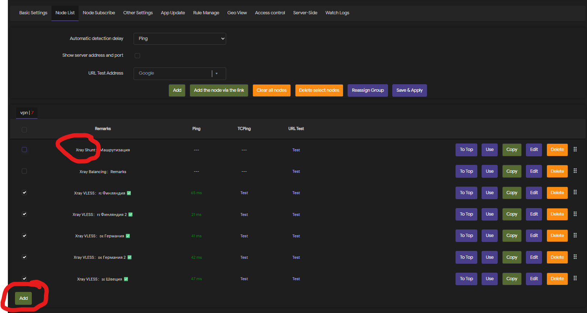
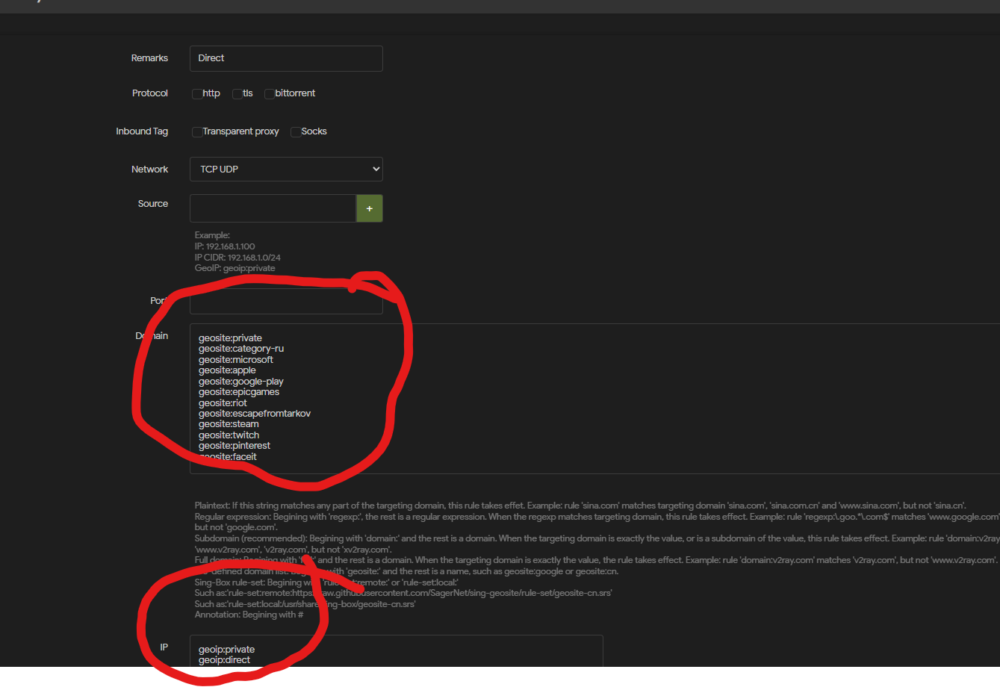
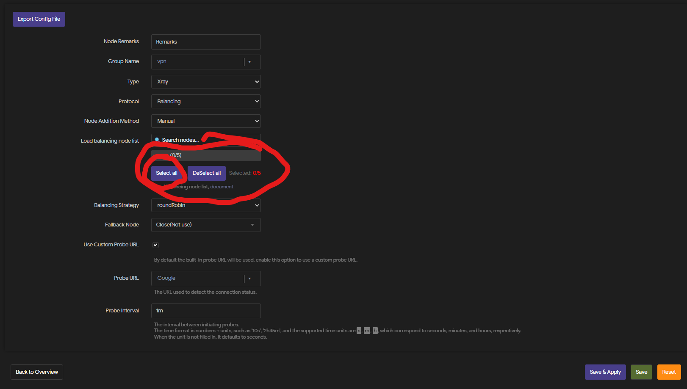
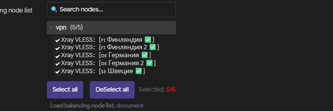
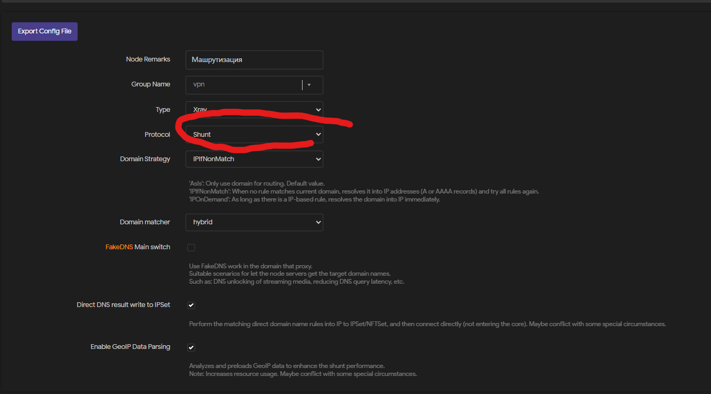
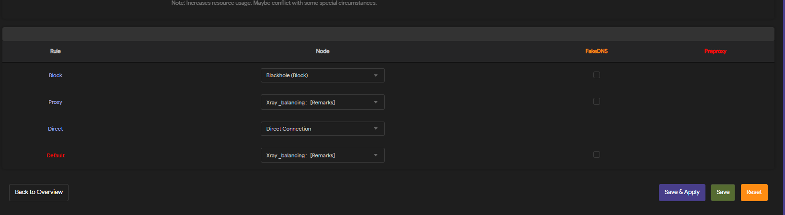
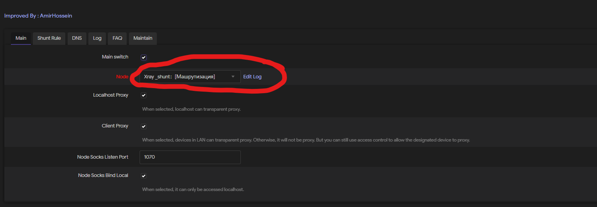
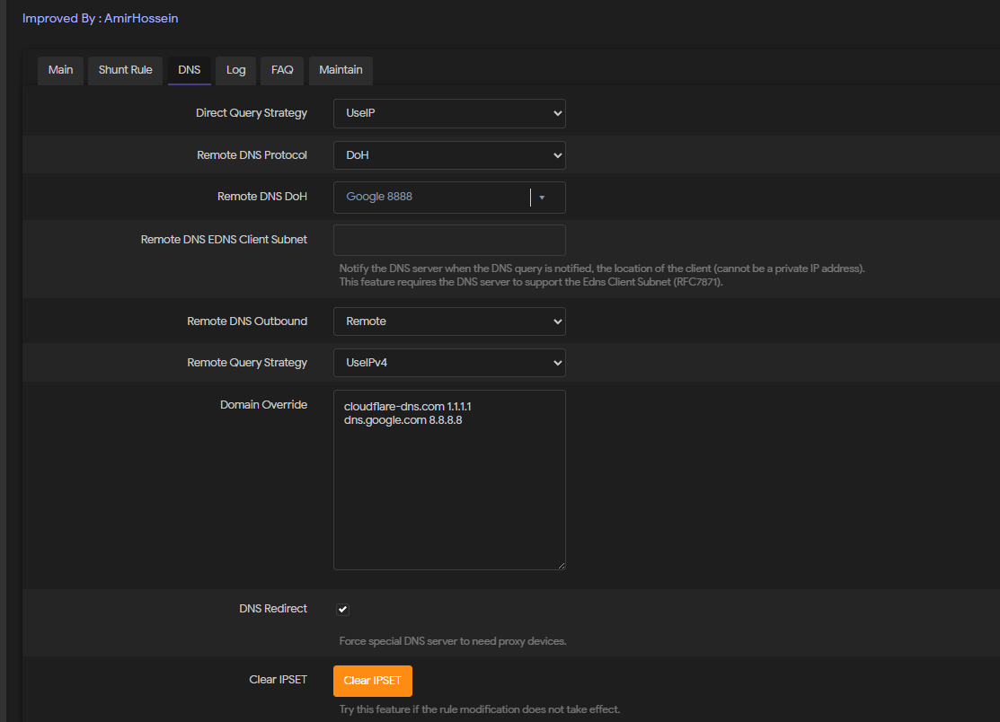
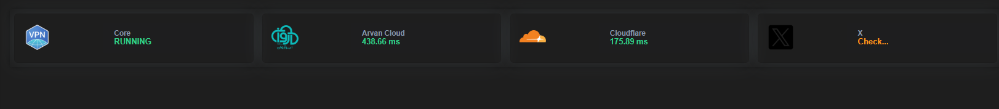

## Настройка

1. Шаг 1 — общие настройки

2. Шаг 2 — конфигурация профиля

3. Шаг 3 — настройки маршрутизации

4. Шаг 4 — выбор режима

5. Шаг 5 — проверка соединения

6. Шаг 6 — логирование и отладка

7. Шаг 7 — дополнительные параметры

8. Шаг 8 — финальная проверка

9. Справочные скриншоты

10. Справочные скриншоты 2

