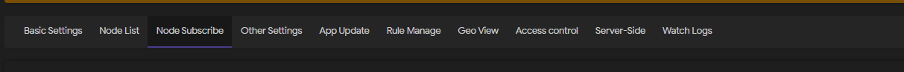
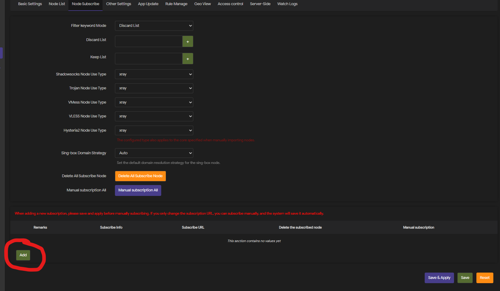
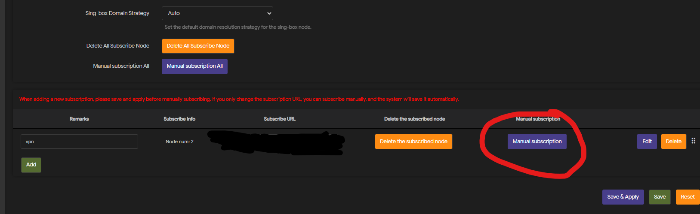

Скрипт установки [Passwall](https://github.com/amirhosseinchoghaei/Passwall) для OpenWRT, выбирать PasswallV2

## Настройка
1. Во вкладке Rule Manage, указать
  GeoIP Update URL - https://cdn.jsdelivr.net/gh/hydraponique/roscomvpn-geoip@release/geoip.dat
  Geosite Update URL - https://cdn.jsdelivr.net/gh/hydraponique/roscomvpn-geosite@release/geosite.dat

  и запустить Manually update

2. Добавим правила для машрутизации в блок Sing-Box/Xray Shunt Rule 
  - [DEFAULT.JSON от hydraponique](https://github.com/hydraponique/roscomvpn-routing/blob/main/HAPP/DEFAULT.JSON)
  - Требуеться создать 3 правила Direct, Proxy, Block

  - Заполнить каждое правило по примеру DEFAULT.JSON

3. Добавим подписку во вкладке Node Subscribe, и запустим сихронизацию кнопкой Manual subscription

4. Добавим Xray Balancing, он нужен для балансировки и в случае недоступности одного из узлов.

2. Добавим Xray Shunt, он требуеться для работы списков машрутизации, и сразу применим правила.

- Не забыть указать, сотвествие куда какой трафик машрутизировать

8. Переходим Basic Settings, и выбираем наш Xray Shunt и включаем Main switch

Скрипт установки [Passwall](https://github.com/amirhosseinchoghaei/Passwall) для OpenWRT, выбирать PasswallV2

## Настройка
1. Во вкладке **Rule Manage**, указать
   **GeoIP Update URL** - https://cdn.jsdelivr.net/gh/hydraponique/roscomvpn-geoip@release/geoip.dat
   **Geosite Update URL** - https://cdn.jsdelivr.net/gh/hydraponique/roscomvpn-geosite@release/geosite.dat

   и запустить **Manually update**

2. Добавим правила для машрутизации в блок **Sing-Box/Xray Shunt Rule** 
    [DEFAULT.JSON от hydraponique](https://github.com/hydraponique/roscomvpn-routing/blob/main/HAPP/DEFAULT.JSON)
  Требуется создать 3 правила **Direct**, **Proxy**, **Block**

  Заполнить каждое правило по примеру **DEFAULT.JSON**

4. Добавим подписку во вкладке **Node Subscribe**, и запустим сихронизацию кнопкой **Manual subscription**

4. Добавим **Xray Balancing**, он нужен для балансировки и в случае недоступности одного из узлов.

2. Добавим **Xray Shunt**, он требуется для работы списков маршрутизации, и сразу применим правила**.!!! Без него не будет работать маршрутизация!!!** 

Не забыть указать, соответствие куда какой трафик маршрутизировать

8. Переходим **Basic Settings**, и выбираем наш **Xray Shunt** и включаем **Main switch**

